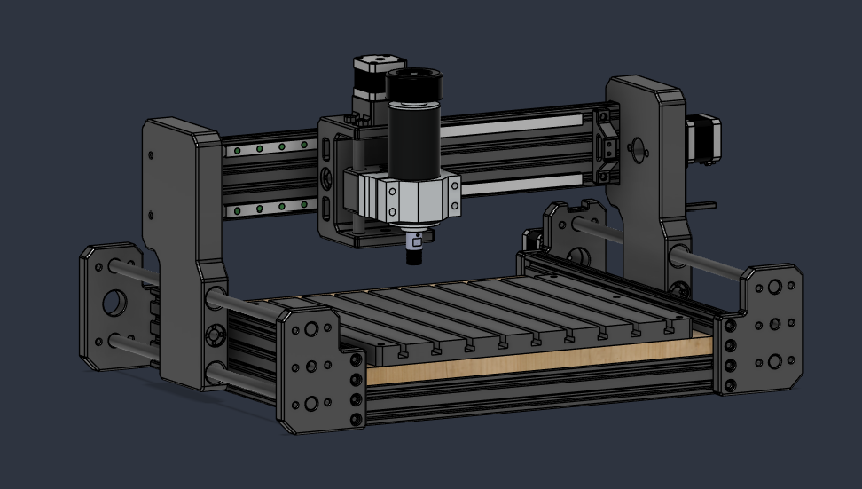

# DIY CNC Router

🚧 **Status: work in progress** - mechanical design and electronics design finished, controller PCB in production, firmware in progress.

A from-scratch CNC router build: mechanical design in CAD, a custom ESP32-based controller board, and FluidNC firmware.

## Table of Contents
- [Overview](#overview)
- [Mechanics](#mechanics)
- [Electronics / Controller](#electronics--controller)
- [Firmware](#firmware)
- [Problems Encountered & Solutions](#problems-encountered--solutions)
- [Photos](#photos)
- [Roadmap](#roadmap)
- [License](#license)

## Overview

This project is a from-scratch 3-axis CNC router designed and built as a personal engineering project, with a working area of 310 × 290 mm. It is intended for light-duty machining of materials such as wood and PCBs.

The project combines mechanical design in Fusion 360, custom electronics designed in KiCad, an ESP32-based motion controller, and FluidNC firmware. The goal is to develop a complete CNC system covering the process from mechanical and electronic design through PCB manufacturing, firmware bring-up, machine calibration, and first machining tests.

## Mechanics

- Full 3D assembly designed in **Fusion 360** - complete
- Printed parts in **PETG** on a **Bambu Lab P2S Combo**

## Electronics / Controller

Custom PCB (KiCad) integrating:
- **ESP32** as the main controller
- **3x TMC2209** — stepper motor drivers
- Firmware: **FluidNC**

### BOM (Bill of Materials)
| Component | Model | Qty |
|---|---|---|
| Microcontroller | ESP32 DevKit V1 | 1 |
| Stepper driver | TMC2209 | 3 |
| Stepper motors | 17HS4401 | 3 |

## Firmware

Based on FluidNC

## Photos

## Roadmap

- [x] Mechanical assembly in Fusion 360
- [x] Controller PCB schematic and layout in KiCad
- [ ] PCB fabrication and assembly
- [ ] FluidNC firmware bring-up
- [ ] First test cut

## License

This project is licensed under the MIT License — see the [LICENSE](LICENSE) file for details.
